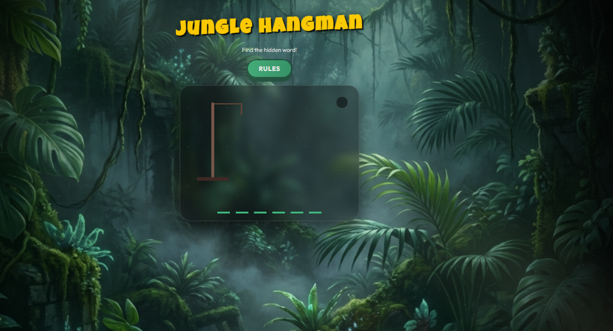

# 🌴 Jungle Hangman

> **Survive the wilderness. Guess the word. Escape the snake.**



## 📖 Overview

**Jungle Hangman** is a visually immersive, jungle-themed reimagining of the classic word-guessing game. Built with **React**, this application features a stunning **Glassmorphism UI**, dynamic animations, and a "Snake" twist where every wrong guess brings a venomous viper closer!

## ✨ Unique Features

-   **🌿 Immersive Jungle Theme**: Lush green backgrounds, vine accents, and atmospheric visuals that transport you to the heart of the rainforest.
-   **🔮 Glassmorphism UI**: Modern, translucent game cards and containers that blend seamlessly with the jungle backdrop.
-   **🐍 Dynamic Snake Animation**: Instead of a stick figure, watch out for the animated snake that appears with every wrong guess!
-   **🔔 SweetAlert2 Integration**: Beautiful, custom-styled popups for game rules and win/loss notifications.
-   **⌨️ Smooth Interaction**: optimized keyboard controls for a seamless gaming experience.

## 🎮 How to Play

1.  **Start the Game**: The game begins immediately with a hidden word.
2.  **Guess a Letter**: Press any letter key **(A-Z)** on your keyboard to make a guess.
    -   **Correct Guess**: The letter reveals itself in the hidden word slots.
    -   **Wrong Guess**: The "Snake" advances! (One step closer to your doom).
3.  **Win Condition**: Reveal the entire word before you run out of moves.
4.  **Lose Condition**: If you make **6 mistakes**, the snake strikes and the game is over.

## 🚀 Getting Started

Follow these steps to run the project locally on your machine.

### Prerequisites
-   Node.js (v14 or higher)
-   npm (v6 or higher)

### Installation

1.  **Clone the repository**
    ```bash
    git clone https://github.com/naitik09090/hangman-game.git
    cd react-hangman
    ```

2.  **Install dependencies**
    ```bash
    npm install
    ```

3.  **Start the development server**
    ```bash
    npm start
    ```
    The game will launch automatically in your browser at `http://localhost:3000`.

## 🛠️ Technologies Used

-   **React 17**: Core framework for component-based UI.
-   **CSS3 (Custom Properties)**: For the advanced Jungle theming and Glassmorphism effects.
-   **SweetAlert2**: For beautiful, responsive modal dialogs.
-   **Vercel / GitHub Pages**: (Optional) For deployment.

## 🤝 Contributing

Got an idea to make the jungle even wilder? Open an issue or submit a pull request!

1.  Fork the Project
2.  Create your Feature Branch (`git checkout -b feature/AmazingFeature`)
3.  Commit your Changes (`git commit -m 'Add some AmazingFeature'`)
4.  Push to the Branch (`git push origin feature/AmazingFeature`)
5.  Open a Pull Request

---

<div align="center">
  <sub>Built with ❤️ by <a href="https://github.com/naitik09090">Naitik</a></sub>
</div>
